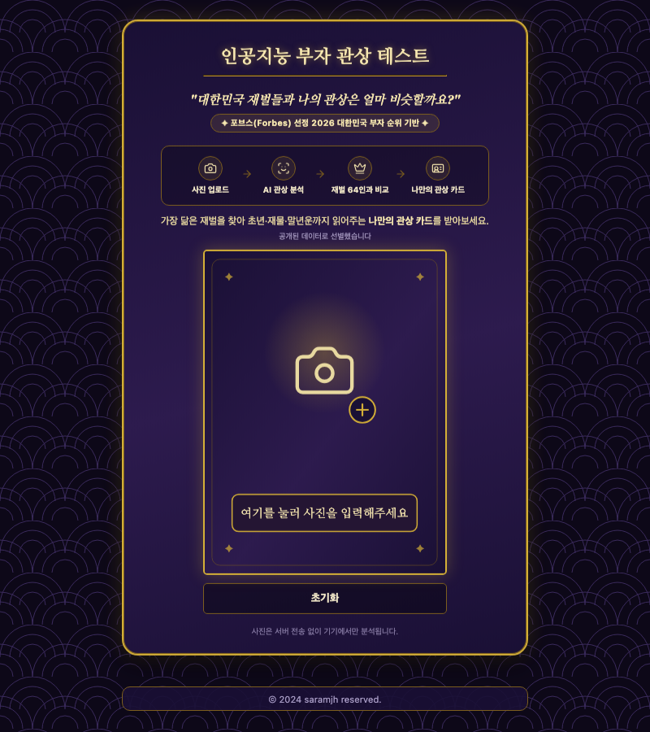

# 인공지능 부자 관상 테스트

[사이트 바로가기](https://saramjh.github.io/richChecker/)

## 프로젝트 개요

포브스(Forbes) 선정 2026 대한민국 부자 순위를 기반으로, 업로드한 얼굴 사진의 관상을 AI로 분석해
대한민국 재벌들과 얼마나 닮았는지 비교해주는 엔터테인먼트 웹 앱입니다. 모든 분석은 **브라우저 안에서만**
이루어지며, 사진이 서버로 전송되지 않습니다(정적 사이트라 애초에 서버가 없습니다).

### 주요 기능

- 사진을 업로드하면 자동으로 얼굴 랜드마크를 분석 (성별 선택 없음, 단일 통합 표본)
- 재벌 표본 중 **가장 닮은 한 명**과의 일치율 + 사진 비교 + 육각 레이더 차트
- 이목구비 6개 항목별 상세 분석(재벌 표본 평균 대비 막대그래프 + 부위별 최근접 인물)
- 6개 항목 중 가장 두드러지는 특징으로 정하는 "재벌 유형" 정체성 배지 (예: 전략가형, 오너형)
- AI 추정 나이 · 표정 인식
- 결과 카드 이미지 저장, 카카오톡/인스타그램/페이스북/X 공유
  - 카카오톡/페이스북/X는 플랫폼 자체 제약으로 링크만 공유 가능 (서버가 없어 방금 생성한
    개인 이미지를 업로드할 방법이 없음)
  - 공유하기·인스타그램 버튼은 OS 공유 시트를 통해 실제 결과 이미지 파일을 첨부
- 효과음(Tone.js 합성음)과 GSAP 애니메이션으로 로딩/리빌 연출

## 사용 기술

- **프론트엔드**: 순수 HTML / CSS / JavaScript (빌드 도구·번들러 없음, 모든 스크립트는 CDN 또는
  셀프호스팅 정적 파일)
- **얼굴 분석**: [MediaPipe Face Landmarker](https://ai.google.dev/edge/mediapipe/solutions/vision/face_landmarker)
  (478 랜드마크, 셀프호스팅 WASM+모델) — 나이 추정만 보조로 face-api.js 사용
- **애니메이션/사운드**: GSAP, Tone.js
- **공유 이미지 캡처**: html2canvas
- **배포**: GitHub Pages (GitHub Actions로 JSON/JS 문법 검증 후 배포)
- **분석/광고**: Google Analytics(GTM), Google AdSense(자동 광고)

## 데이터 & 사전계산 파이프라인

- `data/people.json` — 재벌 표본 인물 목록. 포브스 코리아 2026 50 Richest 중 순위·자산·업적
  정보가 있는 실명 인물 47명으로 구성됩니다. 인구 통계(평균/표준편차)는 이 47명을 기준으로
  계산합니다 — 출처를 알 수 없는 별도의 익명 표본은 두지 않습니다(초상권·저작권 리스크는
  화면 노출 여부와 무관하게 사진을 저장·처리하는 것 자체로 성립하므로, 통계 계산에만 쓰고
  화면에 표시하지 않는 사진이라도 출처가 불분명하면 위험은 똑같습니다).
- 사진 에셋은 `assets/people/caricature/` 한 곳에 모여 있습니다. **47명 전원 실제 사진이
  아니라 AI 생성 캐리커쳐입니다** — 실제 인물 사진은 라이선스가 확인된 일부에게만 쓸 수
  있고 나머지는 쓸 수 없어 결과 화면마다 "이 사람은 진짜 사진, 저 사람은 그림"처럼 표현
  방식이 갈리는 문제가 있었다. 텍스트 설명만으로 생성한 캐리커쳐로 전원 통일해 초상권·
  저작권 리스크 없이 시각적 일관성까지 확보했습니다.
- `data/sources/forbes-korea-2026.json` — 포브스 코리아 2026 50 Richest 원본 기사에서 정리한
  순위·자산·업적 등 구조화 데이터. `data/people.json`을 채울 때 참고한 원자료로, 사진은
  포함하지 않습니다(포함됐던 스크랩 사진은 저작권 문제로 폐기).
- `tools/precompute.html` — 로컬에서 여는 오프라인 개발 도구. `data/people.json`의 사진들을
  MediaPipe로 분석해 `data/embeddings.json`(특징 벡터 + 인구 통계)을 생성합니다. 인물을
  추가/교체할 때마다 이 도구를 다시 실행해 `data/embeddings.json`을 갱신해야 합니다.

## 사용 방법

1. 웹 페이지에 접속해 얼굴 사진을 업로드합니다.
2. AI가 자동으로 얼굴 랜드마크를 분석합니다 (수 초 내외).
3. 가장 닮은 재벌, 재벌 유형, 이목구비 부위별 분석 결과를 확인합니다.
4. 결과를 이미지로 저장하거나 SNS에 공유합니다.

## 개발/배포

- `main` 브랜치에 푸시되면 GitHub Actions가 JSON/JS 문법을 검증한 뒤 GitHub Pages로 배포합니다
  (`.github/workflows/deploy.yml`).
- 매년 1월 3일(KST), 그해 포브스 리스트로 표본을 갱신해야 한다는 걸 상기시키는 GitHub Issue가
  자동으로 열립니다 (`.github/workflows/annual-forbes-reminder.yml`).

## 개인정보 관련 유의사항

- 업로드한 사진은 서버로 전송되지 않고 브라우저(기기) 안에서만 분석됩니다.
- 사이트 이용 통계 및 광고 게재를 위해 Google 애널리틱스·애드센스가 쿠키를 사용할 수 있습니다.

## 기여 방법

기여를 환영합니다! 다음 단계에 따라 프로젝트에 기여할 수 있습니다:

1. 이 저장소를 Fork합니다.
2. 새로운 브랜치를 생성합니다 (`git checkout -b feature/새로운기능`).
3. 변경 사항을 커밋합니다 (`git commit -am 'Add some 새로운기능'`).
4. 브랜치에 푸시합니다 (`git push origin feature/새로운기능`).
5. Pull Request를 생성합니다.

## 라이선스

이 프로젝트의 코드는 [MIT 라이선스](https://opensource.org/licenses/MIT) 하에 배포됩니다.
`assets/people/caricature` 안의 인물 이미지는 전부 텍스트 설명만으로 생성한 AI 캐리커쳐이며,
실제 인물의 사진이 아닙니다.

## 문의

프로젝트에 대한 문의 사항은 [devTestudinidae@gmail.com](mailto:devTestudinidae@gmail.com)으로 연락해 주세요.
