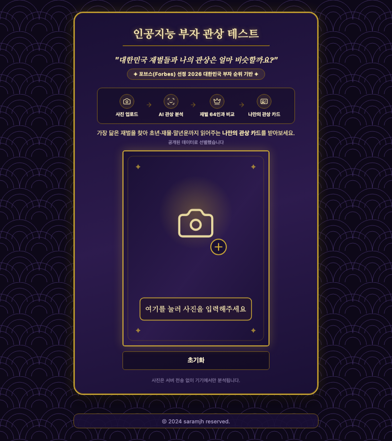

# 부자 관상 테스트

[사이트 바로가기](https://saramjh.github.io/richChecker/)

## 프로젝트 개요

포브스(Forbes) 선정 2026 대한민국 부자 순위를 기반으로, 업로드한 얼굴 사진의 6개 비율을 분석해
47명 표본 중 가장 가까운 부자 3명과 두드러진 얼굴 특징을 보여주는 엔터테인먼트 웹 앱입니다. 모든 분석은 **브라우저 안에서만**
이루어지며, 얼굴 분석용 사진은 서버에 업로드하지 않고 브라우저 안에서 처리합니다.

### 주요 기능

- 사진을 업로드하면 자동으로 얼굴 랜드마크를 분석 (성별 선택 없음, 단일 통합 표본)
- 재벌 표본 47명 중 **전체 6개 얼굴 비율이 가장 가까운 Top 3** + 1위와의 사진 비교 + 육각 레이더 차트
- 얼굴 6개 항목별 상세 분석(0~100 특징 점수 + 항목별 최근접 인물)
- 6개 항목 중 표본 기준점에서 가장 멀리 떨어진 **두드러진 특징**과 그 특징이 가장 가까운 인물
- MediaPipe 기반 표정 인식
- 결과 카드 이미지 저장, 공유하기·인스타그램 버튼으로 OS 공유 시트를 통해 실제 결과 이미지
  파일 공유 (카카오톡/페이스북/X 공식 공유는 서버가 없어 방금 생성한 개인 이미지를 업로드할
  방법이 없어 링크·고정 문구만 보내게 되므로 의미가 없다고 판단해 제외)
- 효과음(Tone.js 합성음)과 GSAP 애니메이션으로 로딩/리빌 연출

## 사용 기술

- **프론트엔드**: 순수 HTML / CSS / JavaScript (빌드 도구·번들러 없음, 모든 스크립트는 CDN 또는
  셀프호스팅 정적 파일)
- **얼굴 분석**: [MediaPipe Face Landmarker](https://ai.google.dev/edge/mediapipe/solutions/vision/face_landmarker)
  (478 랜드마크, 셀프호스팅 WASM+모델)
- **애니메이션/사운드**: GSAP, Tone.js
- **공유 이미지 캡처**: html2canvas
- **배포**: GitHub Pages (GitHub Actions로 JSON/JS 문법 검증 후 배포)
- **분석/광고**: Google Analytics(GTM), Google AdSense(결과 확인 이후 수동 광고 슬롯)

## 데이터 & 사전계산 파이프라인

- `data/people.json` — 재벌 표본 인물 목록. 포브스 코리아 2026 50 Richest 중 순위·자산·업적
  정보가 있는 실명 인물 47명으로 구성됩니다. 인구 통계(평균/표준편차)는 이 47명을 기준으로
  계산합니다 — 출처를 알 수 없는 별도의 익명 표본은 두지 않습니다(초상권·저작권 리스크는
  화면 노출 여부와 무관하게 사진을 저장·처리하는 것 자체로 성립하므로, 통계 계산에만 쓰고
  화면에 표시하지 않는 사진이라도 출처가 불분명하면 위험은 똑같습니다).
- 사진 에셋은 `assets/people/caricature/` 한 곳에 모여 있습니다. **47명 전원 실제 사진이
  아니라 AI 생성 캐리커쳐입니다** — 실제 인물 사진은 라이선스가 확인된 일부에게만 쓸 수
  있고 나머지는 쓸 수 없어 결과 화면마다 "이 사람은 진짜 사진, 저 사람은 그림"처럼 표현
  방식이 갈리는 문제가 있었다. 텍스트 설명만으로 생성한 캐리커쳐로 전원 통일해 초상권·
  저작권 리스크 없이 시각적 일관성까지 확보했습니다.
- `data/sources/forbes-korea-2026.json` — 포브스 코리아 2026 50 Richest 원본 기사에서 정리한
  순위·자산·업적 등 구조화 데이터. `data/people.json`을 채울 때 참고한 원자료로, 사진은
  포함하지 않습니다(포함됐던 스크랩 사진은 저작권 문제로 폐기).
- `tools/precompute.html` — 로컬에서 여는 오프라인 개발 도구. `data/people.json`의 사진들을
  MediaPipe로 분석해 `data/embeddings.json`(특징 벡터 + 인구 통계)을 생성합니다. 인물을
  추가/교체할 때마다 이 도구를 다시 실행해 `data/embeddings.json`을 갱신해야 합니다.

## 사용 방법

1. 웹 페이지에 접속해 얼굴 사진을 업로드합니다.
2. AI가 자동으로 얼굴 랜드마크를 분석합니다 (수 초 내외).
3. 전체 비율 기준 Top 3, 두드러진 특징, 얼굴 부위별 비교 결과를 확인합니다.
4. 결과를 이미지로 저장하거나 SNS에 공유합니다.

### 매칭 회귀 검증

`node tools/matching_contract.mjs`는 전체 표본의 자기 자신 #1, Top 3 정렬/중복 없음, 유사도 표시 정수화, 각 특징 ±0.05σ 변형에서 자기 자신 Top 1/Top 3 유지 여부를 검증합니다. 이 테스트는 이미지 회전·조명 변화 자체를 검증하는 테스트가 아니라, 특징 벡터와 매칭 수학 계약의 회귀를 막는 테스트입니다.

### 첫 화면 전환 원칙

검색·링크로 들어온 사용자는 `무엇을 받는지 → 사진 선택 → 신뢰 정보` 순서로 이해할 수 있어야 합니다. 비어 있는 업로드 영역은 220px로 작게 유지하고, 실제 사진을 선택한 뒤에만 400px 미리보기로 확장합니다. `photo_picker_opened`와 `upload_started`의 `source`로 주 CTA와 업로드 패널의 실제 사용을 비교합니다.

### 디자인 언어 계약

- 보라/골드 관상·트레이딩 카드 테마는 제품 정체성으로 유지합니다.
- 화면 글자 크기는 임의 숫자를 추가하지 않고 `--type-*` 의미 토큰만 사용합니다. 화면용 최소 글자 역할은 12px(`--type-micro`)이며, H1은 `--type-hero`, 본문/컨트롤은 body 계열을 사용합니다.
- 장식용 세리프는 제목·결과 이름 등 display 역할에만, 본문·설명·버튼은 body 폰트를 사용합니다.
- `--gold-dim`은 테두리/장식 전용입니다. 실제 읽어야 하는 작은 텍스트에는 대비가 확보된 gold/text 색 역할을 사용합니다.
- 주요 CTA와 저장 액션은 최소 48px, 보조 액션은 40~44px 이상의 조작 높이를 유지하고, 모바일은 내부 폭을 다시 축소하지 않습니다.
- 한국/글로벌 CSS 구조는 언어별 폰트 스택을 제외하고 동일하게 유지합니다. `node tools/design_contract.mjs`가 타이포그래피 토큰, 폰트 역할, 텍스트 대비 역할, 액션 크기, 모바일 폭, 레이더 라벨 최소 크기를 CI에서 검증합니다.

### 런타임/퍼널 계측 계약

- 새 사진의 `load` 리스너를 `src` 변경 전에 설치해 실제로 새 픽셀이 준비된 뒤에만 MediaPipe 분석을 시작합니다. 기존 placeholder의 `complete` 상태를 새 사진 준비 완료로 재사용하지 않으며, 첫 비동기 모델 로드 전에 선택된 픽셀을 분석용 canvas로 고정합니다.
- 파일 input은 선택 즉시 비워 같은 파일을 연속 선택해도 `change`가 다시 발생합니다. 분석/전환 cleanup은 직렬화하며, 얼굴 검출은 최대 2회까지만 내부 재시도하고 `detection_attempts`로 기록합니다.
- 핵심 결과 유사도는 애니메이션 값이 아니라 실제 계산값을 즉시 렌더링하며, 로딩 전환 cleanup은 GSAP 완료 콜백이 멈춰도 timeout fallback으로 반드시 종료됩니다.
- 결과 광고는 핵심 결과 렌더가 완료된 뒤 비동기로 초기화하며, AdSense 슬롯 크기/네트워크 오류는 분석 성공 상태에 영향을 주지 않습니다.
- analysis_complete는 결과 UI 렌더가 성공한 뒤에만 기록하며, 한 시도에서 analysis_complete와 analysis_error가 동시에 기록되지 않도록 보호합니다.
- 분석 이벤트에는 source, entry_ref, model_warm, data_warm, 파일/이미지 크기와 각 단계 처리시간을 포함합니다.
- same-origin 유입은 rich-tester, rich-face-test, 글로벌 소개 글, 한국/글로벌 edition으로 분류하며 외부 referrer URL 자체는 이벤트 파라미터로 보내지 않습니다.
- node tools/runtime_contract.mjs가 새 이미지 source gate, 같은 파일 재선택, 업로드 직렬화, bounded detection retry, 첫 업로드 snapshot, promise dedupe, 결과 렌더 후 completion, referrer/성능 계측 계약을 CI에서 검증합니다.

## 에디션 간 연결

이 서비스는 서로 다른 표본을 쓰는 두 에디션으로 운영합니다. 한국판은 한국 부자 47인, 글로벌판은 억만장자 100인 표본을 사용하며 단순 번역 페이지가 아닙니다. 따라서 `hreflang` 번역 관계 대신 일반 크롤러블 링크로 상호 연결합니다. 첫 행동 뒤의 에디션 전환과 결과 후 다른 에디션 CTA는 `cross_edition_click` 이벤트의 `placement`, `target_edition`, `link_url`로 측정합니다.

## 개발/배포

- `main` 브랜치에 푸시되면 GitHub Actions가 JSON/JS 문법을 검증한 뒤 GitHub Pages로 배포합니다
  (`.github/workflows/deploy.yml`).
- 매년 1월 3일(KST), 그해 포브스 리스트로 표본을 갱신해야 한다는 걸 상기시키는 GitHub Issue가
  자동으로 열립니다 (`.github/workflows/annual-forbes-reminder.yml`).

## 개인정보 관련 유의사항

- 얼굴 매칭용 사진은 서버에 업로드하지 않고 브라우저(기기) 안에서만 분석됩니다.
- 사이트 이용 통계 및 광고 게재를 위해 Google 애널리틱스·애드센스가 쿠키를 사용할 수 있습니다.

## 기여 방법

기여를 환영합니다! 다음 단계에 따라 프로젝트에 기여할 수 있습니다:

1. 이 저장소를 Fork합니다.
2. 새로운 브랜치를 생성합니다 (`git checkout -b feature/새로운기능`).
3. 변경 사항을 커밋합니다 (`git commit -am 'Add some 새로운기능'`).
4. 브랜치에 푸시합니다 (`git push origin feature/새로운기능`).
5. Pull Request를 생성합니다.

## 라이선스

이 프로젝트의 코드는 [MIT 라이선스](https://opensource.org/licenses/MIT) 하에 배포됩니다.
`assets/people/caricature` 안의 인물 이미지는 전부 텍스트 설명만으로 생성한 AI 캐리커쳐이며,
실제 인물의 사진이 아닙니다.

## 문의

프로젝트에 대한 문의 사항은 [saramjh@gmail.com](mailto:saramjh@gmail.com)으로 연락해 주세요.

- 2026-09-30 runtime/UI contract: core MediaPipe/WASM/data warm-up begins during deferred runtime execution; every analysis explicitly restores loader visibility; share PNGs are prepared before share clicks; result spacing is owned by shared `--space-*` tokens and `.result-actions`.

- 2026-09-30 transition contract: selecting a file must show the full-viewport processing state before FileReader/decode work begins; every analysis keeps that state perceptible for at least 900 ms; long results switch the page to top-aligned `result-mode`; reset collapses result DOM and restores scroll/initial geometry before revealing the intro; result motion starts only after the processing overlay exits.

- 2026-09-30 transition follow-up: the processing overlay gets a paint opportunity before decode/detection; the offscreen share card is `display:none` except during capture so it cannot inflate document height; expensive html2canvas preparation is armed only when the result actions approach the viewport, never during the initial result reveal.
